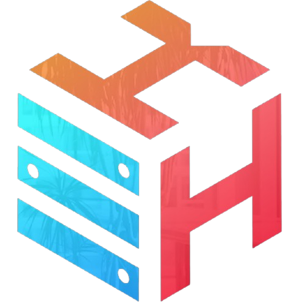
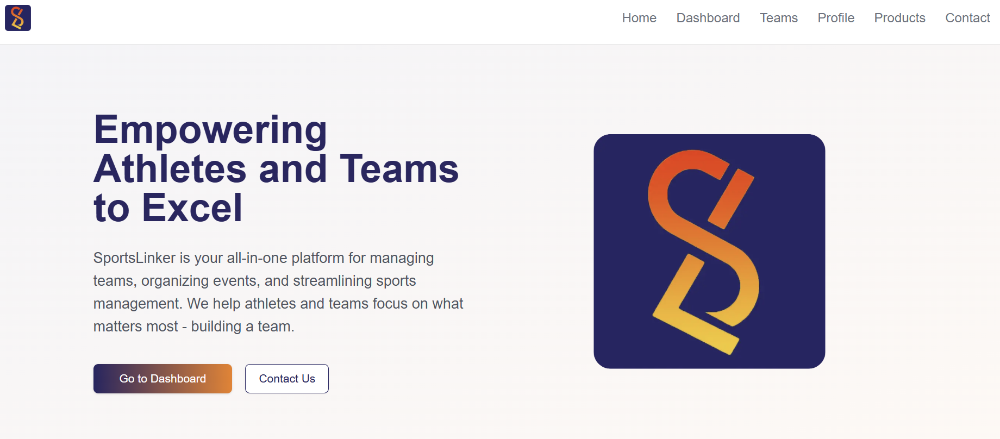
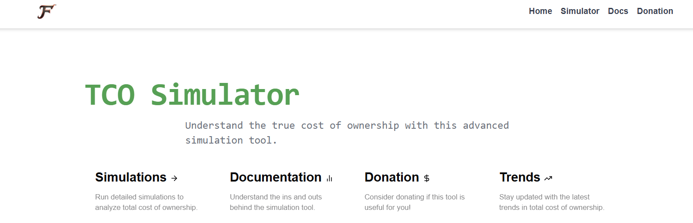
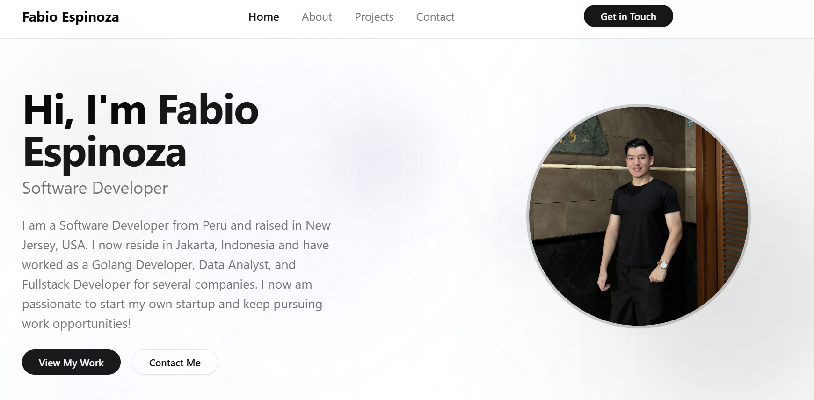
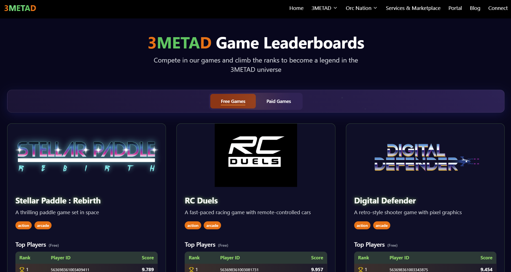

  

<h1 align="center">Fabio Espinoza's GitHub</h1>

---

## 🧑‍💻 Work Experience

<table>
<!-- verde -->
  <tr>
  <td width="100" valign="center">
    
  </td>
  <td valign="top">
    <strong>VerdeKinetics</strong> 
    <em>Singapore</em> 
    🗓️ <strong> Duration </strong>   Sep 2022 -   Dec 2024
  </td>
  <td valign="top">
    <strong>Backend Golang Developer</strong>
    
Creating scalable microservices in Golang for a microloan platform and deploying via Google Cloud Platform / Docker.

  </td>
</tr>

<!-- ICCT -->
  <tr>
    <td width="100" valign="center">
      
    </td>
    <td valign="top">
    <strong>ICCT </strong> 
    <em>USA</em> 
     🗓️ <strong> Duration </strong>   May 2023 -   Dec 2024
  </td>
  <td valign="top">
    <strong>Data Analyst</strong>
    
Created Tableau Dashboards and collected latest EV model data via webscraping. Created Python course and created centralized RSS Feed for team.

  </td>
  </tr>

  <!-- KIWIHOSTING -->
  <tr>
    <td width="100" valign="center">
      
    </td>
    <td valign="top">
    <strong>Kiwi Hosting</strong> 
    <em>Australia</em> 
     🗓️ <strong> Duration </strong>   March 2024 -   Dec 2024
  </td>
  <td valign="top">
    <strong>Fullstack Dev / Project Manager</strong>
    
Implemented Authentication with OAuth, JWT, 2FA, and QR Code. Additionally created a Billing Panel for the hosting service.

  </td>
  </tr>

  <!-- SportsLinker -->
  <tr>
    <td width="100" valign="center">
      
    </td>
    <td valign="top">
    <strong>SportsLinker</strong> 
    <em>Indonesia</em> 
     🗓️ <strong> Duration </strong>   Jan 2025 -   Present
  </td>
  <td valign="top">
    <strong>Fullstack Dev / Project Manager</strong>
    
Created a scalable SASS sports management platform from scratch fully equipped with CI/CD , payment gateway, authentication and server monitoring

  </td>
  </tr>
</table>

---

## 🚀 My Favorite Languages and Technologies

  
  
  
  
  
  
    
  
  
  
  
  
  
    
  
  
  
  
  
  

---

### 🌐 My Projects

<table>
  <tr>
    <td valign="center" width="200">
      <a href="https://sportslinkerhq.com">
         
        <strong><em>SportsLinker</em></strong>
      </a>
    </td>
    <td valign="center" width="200">
      <a href="https://tco-simulator.fabrzy.dev">
         
        <strong><em>TCO Simulator</em></strong>
      </a>
    </td>
    <td valign="center" width="200">
      <a href="https://" target="_blank">
         
        <strong>Portfolio Site</strong>
      </a>
    </td>
    <td valign="center" width="200">
      <a href="https://" target="_blank">
         
        <strong>Leaderboard Site</strong>
      </a>
    </td>
  </tr>
</table>

##### Algorithm Visualizer

> 

---

### 📬 Contact Me

  <a href="mailto:fabrzytech@gmail.com">
    
     
    <strong>fabrzytech@gmail.com</strong>
  </a>

